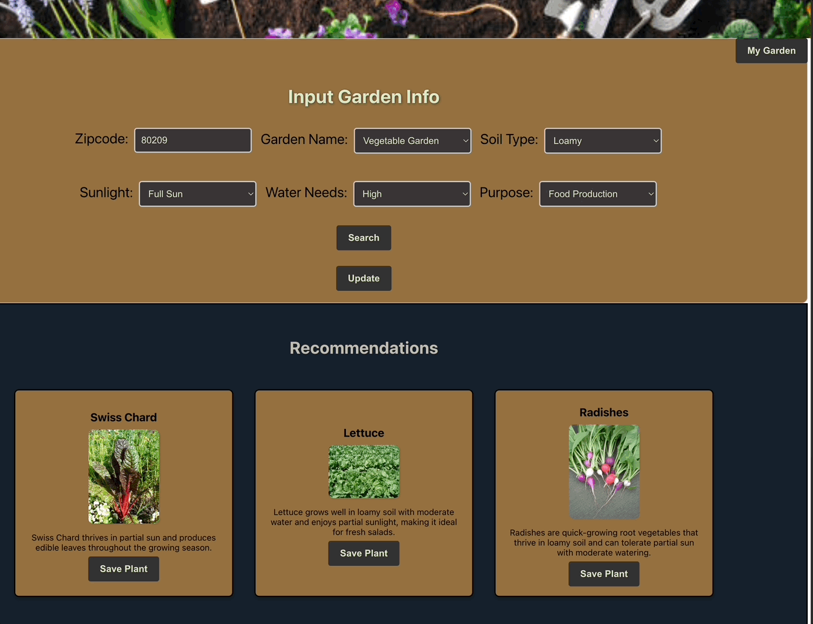

# Smart Gardening

## Description
Smart Gardening is a beginner-friendly gardening app that allows users to enter their information into the **Input Garden Info** form. Once the user clicks **Search**, the app returns 2-3 plant suggestions based on the information provided. The **zip code** is used to determine the user's **Plant Hardiness Zone**, while the other dropdown menus specify the desired plant characteristics, such as:

- The type of soil they will be using,
- The amount of sunlight the plant will receive,
- The level of watering needs they can accommodate, and
- The purpose of the plants, ranging from food production to aesthetic use.

The app provides users with the ability to save their selected plants, which can then be viewed by clicking the **My Garden** button.

## Features
- A homepage displaying the app mascot, **Plantie**, in the form of an animation.
- A form where users can enter information necessary to receive plant suggestions.
- A **Recommendations** section that displays plant suggestions, including images and brief descriptions.
- A **Save Plant** button so users can save plants to their garden.
- A **My Garden** button where users can view saved plants from their current or previous searches.
- A delete button in the **My Garden** section, allowing users to remove plants from their garden.

The app is built using **React** and leverages **React Router** for navigation. It sends user-provided data from the input form to the backend to populate a prompt, which is then sent to the **OpenAI API**. Once a successful response is received, the returned data is sent to the **Google Cloud API** via a custom-configured search engine. The app then displays the returned plant data, including the plant name, an image, and a brief description.

The planning, preparation, and development of this project were completed over the course of **13 days**.

## Approaches to Building
- **Component-Driven Development**: The app is structured with reusable components such as `Plants`, `Header`, `GardenInput`, `Gardens`, and `App` to improve maintainability and scalability.
- **React Router**: Implemented for seamless navigation between pages, ensuring a dynamic and user-friendly experience.
- **API Integration**: The app fetches data from two APIs—**OpenAI API** and **Google Cloud API**—to provide custom responses based on user-provided information.
- **Testing**: End-to-end testing with **Cypress** ensures that the app functions correctly and meets user story requirements.

## Links
- **Deployed Application**: [Smart Gardening Live Site](https://smart-gardening-fe.vercel.app/)
- **GitHub Back End Repository**: [Smart Gardening Back End Repository](https://github.com/sethverrill/smart-gardening-be)
- **GitHub Front End Repository**: [Smart Gardening Front End Repository](https://github.com/wally-yawn/smart_gardening_fe)
- **GitHub Project Board**: [Project Board](https://github.com/users/sethverrill/projects/5)

## App Demonstration

## Project Setup (Cloning from GitHub)
This project is built using Vite and React. To get started:

1. Clone the repository: `git clone git@github.com:wally-yawn/smart_gardening_fe.git`
2. cd your-repo-name
3. Install dependencies: `npm install`
4. Start the development server: `npm run dev`

## Migrating from Create React App (CRA) to Vite
If you previously have set this project up as a CRA project you will need to follow these steps to migrate it to Vite:

1. Remove CRA-specific packages
`npm uninstall react-scripts`
2. Install Vite 
`npm install --save-dev vite`
3. Install React plugin
`npm install @vitejs/plugin-react`
4. Install any other libraries
`npm install`
5. Note that to start the development server the command is now `npm run dev`

## Team Members
#### Wally Wallace
- [LinkedIn Profile](https://www.linkedin.com/in/wally--wallace)
- [GitHub Profile](https://github.com/wally-yawn)

#### Seth Verrill
- [LinkedIn Profile](https://www.linkedin.com/in/sethverrill)
- [GitHub Profile](https://github.com/sethverrill)

#### Devlin Lynch
- [LinkedIn Profile](https://www.linkedin.com/in/devlin-lynch)
- [GitHub Profile](https://github.com/devklynch)

#### Kaelin Salazar
- [LinkedIn Profile](https://www.linkedin.com/in/kaelin-salazar)
- [GitHub Profile](https://github.com/kaelinpsalazar)

#### Bryan Willett
- [LinkedIn Profile](https://www.linkedin.com/in/bryan--willett)
- [GitHub Profile](https://github.com/bwillett2003)